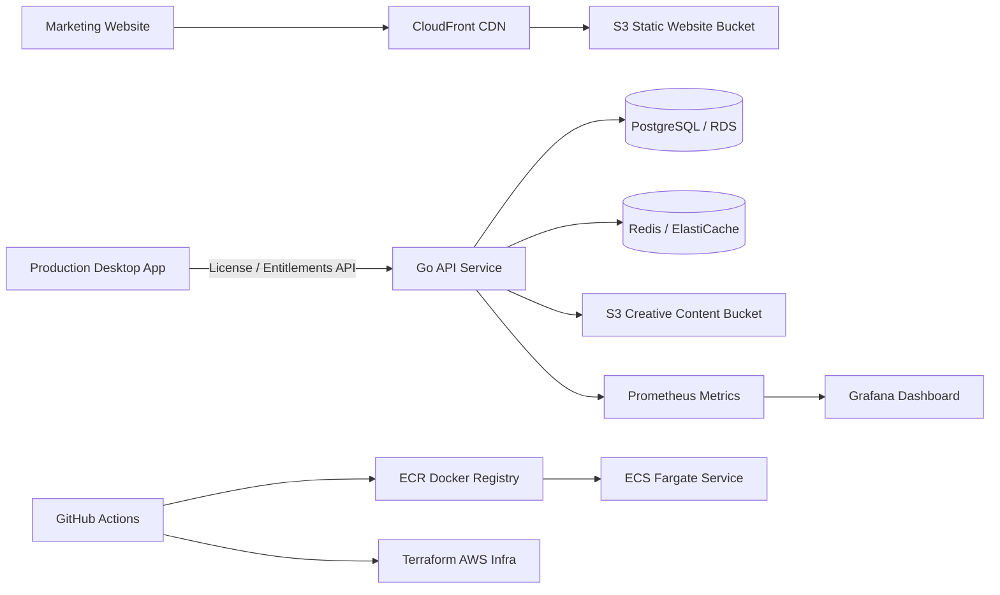

# RV-Style Platform Demo

A screen-share-ready DevOps/Platform Engineering demo that models a realistic production platform for a desktop presentation app that needs license validation, device registration, subscription entitlements, CDN-hosted web content, secure creative-content delivery, CI/CD, observability, and multi-environment AWS infrastructure.

> This is a fictional demo platform. It is intentionally not branded as or connected to Renewed Vision.

## What this demonstrates

- Static marketing site hosted through S3 + CloudFront
- Go API for license validation, device registration, and content entitlements
- PostgreSQL-backed app data model
- Redis cache for resilience and latency reduction
- Dockerized local development
- Terraform-managed AWS infrastructure
- GitHub Actions CI/CD with GitHub OIDC to AWS
- Multi-environment deploy pattern: `dev`, `staging`, `prod`
- Multi-region-ready design with CDN + health checks + failover notes
- Prometheus metrics and Grafana dashboard
- Operational runbooks and SLO definitions

## Architecture



## Local quick start

```bash
cp apps/api/.env.example apps/api/.env
docker compose up --build
```

API health:

```bash
curl http://localhost:8080/healthz
curl http://localhost:8080/readyz
```

Validate a license:

```bash
curl -X POST http://localhost:8080/api/v1/license/validate \
  -H "Content-Type: application/json" \
  -d '{
    "license_key": "RV-DEMO-1234",
    "device_id": "macbook-production-booth-01",
    "app": "presenter",
    "version": "7.18.0"
  }'
```

Register a device:

```bash
curl -X POST http://localhost:8080/api/v1/device/register \
  -H "Content-Type: application/json" \
  -d '{
    "license_key": "RV-DEMO-1234",
    "device_id": "front-of-house-imac",
    "hostname": "foh-imac.local",
    "os": "macOS",
    "app_version": "7.18.0"
  }'
```

Fetch content entitlements:

```bash
curl "http://localhost:8080/api/v1/content/entitlements?license_key=RV-DEMO-1234"
```

Metrics:

```bash
curl http://localhost:8080/metrics
```

## Deployment overview

1. Create GitHub repo.
2. Add GitHub environments: `dev`, `staging`, `prod`.
3. Configure AWS OIDC role for GitHub Actions.
4. Set repo variables/secrets:
   - `AWS_REGION`
   - `AWS_ROLE_TO_ASSUME`
   - `TF_STATE_BUCKET`
   - `TF_LOCK_TABLE`
5. Bootstrap Terraform backend.
6. Run GitHub Action: `Terraform Plan`.
7. Merge to `main` to deploy dev. Promote to staging/prod with environment approvals.

## Demo talk track

Open with:

> I built a small platform demo around a common need for production software: a local desktop app must reliably validate licensing, register devices, and fetch subscription-based creative content. The platform uses CDN delivery for static assets, a containerized API, managed database/cache layers, GitHub Actions, Terraform, observability, and runbooks.

Show in order:

1. `README.md` architecture diagram
2. `apps/api` endpoints
3. `docker compose up --build`
4. `curl` license validation
5. `/metrics` output
6. Terraform modules under `infra/terraform`
7. GitHub Actions workflows
8. Grafana dashboard and SLO/runbook docs

## Repo layout

```text
apps/
  api/                 Go API service
  web/                 Static marketing site
infra/
  terraform/           AWS IaC
ops/
  dashboards/          Grafana dashboard JSON
  prometheus/          Local Prometheus config
  runbooks/            SLOs and incident response
.github/workflows/     CI/CD pipelines
docker-compose.yml     Local development stack
```
